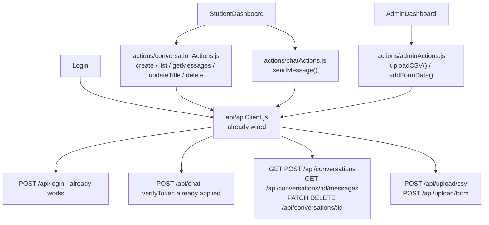
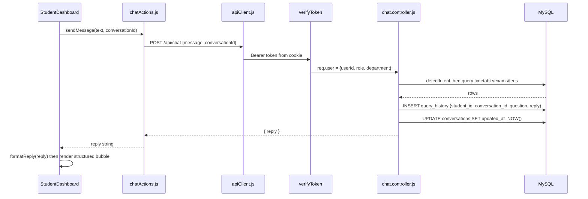

# Chatbot Fullstack Integration Plan

## Overview

Integrate the React/Vite frontend with the Express/MySQL backend — wiring conversation session management, chat history, response formatting, admin uploads, and all missing action/API layers for a fully functional chatbot.

---

## Implementation Status: COMPLETE ✓

All 10 tasks have been implemented. See the sections below for what was built.

---

## What Was Already in Place (Before This Sprint)

- **`src/api/apiClient.js`** — Axios instance already created with `VITE_API_BASE_URL`, request interceptor reading JWT from `universal-cookie` (`authToken`), and a 401 response interceptor redirecting to `/login`. Axios, universal-cookie, and jwt-decode are already installed in `package.json`.
- **`Login.jsx`** — Already wired to `apiClient.post("/login")`, stores token in cookie via `universal-cookie`. Login flow is complete.
- **`ProtectedRoute.jsx`** — Already uses `universal-cookie` + `jwt-decode` to read `authToken`, checks expiry and role. Fully functional.
- **`App.jsx`** — Routes: `/login`, `/student-dashboard`, `/admin-dashboard`, `/chat`. The `/chat` route renders the bare `Chat.jsx`.
- **`chat.routes.js`** — `verifyToken` is already imported and applied to `POST /api/chat`. Route is already protected.
- **`jwt.js`** — Already encodes `department: user.department || null` in the token payload.
- **`auth.service.js`** — Already JOINs `users` with `students` on `username = roll_number` to get `department`, so `department` is in the JWT at login time. No extra DB call needed in `chat.controller.js`.

### What Was Implemented in This Sprint

- `database/schema.sql` — Added `conversations` table, `user_id` FK to `students`, `conversation_id` FK in `query_history`
- `backend/.env` + `.env.example` — Created `.env`, added `JWT_SECRET` to example
- `backend/db.js` — Now uses `process.env.*`, fixed DB name
- `backend/src/config/jwt.js` + `backend/src/middleware/auth.js` — Use `process.env.JWT_SECRET`
- `backend/server.js` — Added `dotenv.config()`, registered `conversationRoutes` and `uploadRoutes`
- `backend/src/controllers/conversation.controller.js` — CRUD: create, list, getMessages, updateTitle, delete
- `backend/src/routes/conversation.routes.js` — All routes protected by `verifyToken`
- `backend/src/controllers/chat.controller.js` — Reads `department` from JWT, accepts `conversationId`, saves to `query_history`
- `backend/src/controllers/upload.controller.js` — CSV bulk insert + form single-row insert for timetable/exams/fees
- `backend/src/routes/upload.routes.js` — Protected by `verifyToken` + admin role check
- `frontend/.env` — `VITE_API_BASE_URL=http://localhost:5000/api`
- `frontend/src/actions/chatActions.js` — `sendMessage(message, conversationId)`
- `frontend/src/actions/conversationActions.js` — create, list, getMessages, updateTitle, delete
- `frontend/src/actions/adminActions.js` — `uploadCSV`, `addFormData`
- `frontend/src/utils/formatReply.js` — Parses multiline bot replies into structured table or plain text
- `frontend/src/pages/StudentDashboard.jsx` — Full rewrite: live sidebar, conversation sessions, chat history, typing indicator, welcome screen, auto-scroll, optimistic messages, delete conversations
- `frontend/src/pages/AdminDashboard.jsx` — Cookie-based logout, wired upload actions, success/error feedback banner
- `frontend/src/App.jsx` — Removed `/chat` route, added root redirect to `/login`
- `frontend/src/pages/Chat.jsx` — Deleted (superseded)

---

## Part 1 — Database Schema Changes

### Problem with current `query_history`

Every message is a loose row with no session grouping — impossible to build the sidebar "Recent Chats" from this:

```sql
-- CURRENT (flat)
CREATE TABLE query_history (
  id INT AUTO_INCREMENT PRIMARY KEY,
  student_id INT,
  question TEXT,
  response TEXT,
  created_at TIMESTAMP DEFAULT CURRENT_TIMESTAMP
);
```

### Solution — Add `conversations` + alter `query_history`

```sql
-- 1. Link students to users directly (students already JOIN via username=roll_number,
--    but adding user_id FK enables clean direct lookup)
ALTER TABLE students
  ADD COLUMN user_id INT UNIQUE,
  ADD FOREIGN KEY (user_id) REFERENCES users(user_id);

-- 2. One row per chat session
CREATE TABLE conversations (
  id INT AUTO_INCREMENT PRIMARY KEY,
  user_id INT NOT NULL,
  title VARCHAR(255) NOT NULL DEFAULT 'New Conversation',
  created_at TIMESTAMP DEFAULT CURRENT_TIMESTAMP,
  updated_at TIMESTAMP DEFAULT CURRENT_TIMESTAMP ON UPDATE CURRENT_TIMESTAMP,
  FOREIGN KEY (user_id) REFERENCES users(user_id)
);

-- 3. Tag every query_history row with a conversation
ALTER TABLE query_history
  ADD COLUMN conversation_id INT NOT NULL AFTER student_id,
  ADD FOREIGN KEY (conversation_id) REFERENCES conversations(id) ON DELETE CASCADE;
```

**Session lifecycle:**

- "New Chat" click → `POST /api/conversations` → new row returned as `{ id, title, created_at }`
- Each message send → `POST /api/chat` with `{ message, conversationId }` → saved to `query_history`
- After first message → `PATCH /api/conversations/:id` → sets `title` to first 40 chars of message
- Sidebar load → `GET /api/conversations` → all sessions for user, ordered by `updated_at DESC`
- Click past chat → `GET /api/conversations/:id/messages` → all Q&A pairs for that session

---

## Part 2 — Full Architecture



---

## Part 3 — Backend Changes

### 3a. `server.js` — add dotenv + register new routes

```js
import dotenv from "dotenv";
dotenv.config(); // must be first before any process.env usage

import conversationRoutes from "./src/routes/conversation.routes.js";
import uploadRoutes from "./src/routes/upload.routes.js";

app.use("/api", conversationRoutes);
app.use("/api", uploadRoutes);
```

Install `dotenv` via npm.

### 3b. `db.js` — use env vars, fix DB name

```js
export const db = await mysql.createConnection({
  host: process.env.DB_HOST,
  user: process.env.DB_USER,
  password: process.env.DB_PASSWORD,
  database: process.env.DB_NAME,   // was hardcoded as wrong name
});
```

### 3c. `jwt.js` + `auth.js` — use env secret

Both files replace hardcoded `"MY_SECRET_KEY"` with `process.env.JWT_SECRET`.

### 3d. `.env.example` — add JWT_SECRET

```
DB_HOST=localhost
DB_USER=root
DB_PASSWORD=yourpassword
DB_NAME=college_chatbot
PORT=5000
JWT_SECRET=your_jwt_secret
```

### 3e. `chat.controller.js` — use JWT department + save history

`department` is already in `req.user.department` (set at login, encoded in JWT). No extra DB call needed.

Changes:
- Remove `department` from `req.body`, read from `req.user.department` instead
- Accept `conversationId` from `req.body`
- After building `reply`, persist to DB:

```js
const { message, conversationId } = req.body;
const department = req.user.department;
// ... intent detection and reply building ...
await db.execute(
  'INSERT INTO query_history (student_id, conversation_id, question, response) VALUES (?, ?, ?, ?)',
  [req.user.userId, conversationId, message, reply]
);
await db.execute('UPDATE conversations SET updated_at = NOW() WHERE id = ?', [conversationId]);
return res.json({ reply });
```

### 3f. New: `conversation.controller.js`

| Function | Route | Description |
|---|---|---|
| `createConversation` | `POST /api/conversations` | Insert new row, return `{ id, title, created_at }` |
| `listConversations` | `GET /api/conversations` | All conversations for `req.user.userId`, ordered by `updated_at DESC` |
| `getMessages` | `GET /api/conversations/:id/messages` | All `query_history` rows for that `conversation_id`, returned as `[{ role: 'user'/'bot', text, created_at }]` |
| `updateTitle` | `PATCH /api/conversations/:id` | Update `title`, verify ownership |
| `deleteConversation` | `DELETE /api/conversations/:id` | Delete row, cascade removes messages |

All routes protected by `verifyToken`. Ownership check: `conversation.user_id === req.user.userId`.

### 3g. New: `upload.controller.js`

- `uploadCSV` — multer file parse, `csv-parser` streaming, bulk INSERT into `timetable`/`exams`/`fees` based on `dataType`
- `addFormData` — JSON body, single-row INSERT into correct table, validated by `dataType`
- Both: `verifyToken` + `req.user.role !== 'admin'` → 403

### 3h. New route files

```
backend/src/routes/conversation.routes.js   ← all verifyToken-protected
backend/src/routes/upload.routes.js          ← verifyToken + admin role guard
```

---

## Part 4 — Frontend Changes

### 4a. Create `frontend/.env`

```
VITE_API_BASE_URL=http://localhost:5000/api
```

### 4b. `apiClient.js` — no structural change needed

Already correctly wired. The 401 redirect to `/login` matches `App.jsx`. No changes required.

### 4c. New: `frontend/src/actions/chatActions.js`

```js
import apiClient from "../api/apiClient";

export async function sendMessage(message, conversationId) {
  const res = await apiClient.post("/chat", { message, conversationId });
  return res.data.reply;  // backend returns { reply }, not { message }
}
```

### 4d. New: `frontend/src/actions/conversationActions.js`

```js
import apiClient from "../api/apiClient";

export const createConversation = () => apiClient.post("/conversations");
export const listConversations = () => apiClient.get("/conversations");
export const getMessages = (id) => apiClient.get(`/conversations/${id}/messages`);
export const updateTitle = (id, title) => apiClient.patch(`/conversations/${id}`, { title });
export const deleteConversation = (id) => apiClient.delete(`/conversations/${id}`);
```

### 4e. New: `frontend/src/actions/adminActions.js`

```js
import apiClient from "../api/apiClient";

export async function uploadCSV(dataType, file) {
  const form = new FormData();
  form.append("dataType", dataType);
  form.append("file", file);
  return apiClient.post("/upload/csv", form, {
    headers: { "Content-Type": "multipart/form-data" }
  });
}

export const addFormData = (dataType, data) =>
  apiClient.post("/upload/form", { dataType, ...data });
```

### 4f. New: `frontend/src/utils/formatReply.js`

Backend returns a plain multiline string. This utility parses and structures it for the chat bubble.

**Single-line reply** (fallback/error) → renders as `<p>`.

**Multiline reply** (timetable, exams, fees) → split on `\n`, first line is bold heading, remaining lines split on ` : ` for two-column display:

Input:
```
Your classes on Monday:
09:00 - 10:00 : Data Structures
10:00 - 11:00 : Operating Systems
```

Rendered inside bot bubble:
- Bold heading: "Your classes on Monday:"
- Each data line as a flex row: left = time range (monospace, indigo tint), right = subject name

### 4g. `StudentDashboard.jsx` — full rewrite

The current file is the designed chat UI shell (sidebar + message area). It will be fully wired with live data. The bare `Chat.jsx` component is superseded and will be deleted.

**State:**
```
conversations[]        ← sidebar list, from GET /api/conversations on mount
activeConversationId   ← null = show welcome screen
messages[]             ← from GET /api/conversations/:id/messages on sidebar click
inputValue             ← controlled text input
isLoading              ← true while awaiting bot reply (show typing bubble)
isSidebarLoading       ← true while fetching conversations list (show skeleton)
```

**Full conversation flow:**

1. Mount → `listConversations()` → populate sidebar
2. "New Chat" button → `createConversation()` → prepend to `conversations[]` → set active → clear `messages[]`
3. Sidebar item click → set `activeConversationId` → `getMessages(id)` → populate `messages[]`
4. Send message:
   - If no `activeConversationId`, auto-create one first
   - Optimistically append `{ role: 'user', text: inputValue }` to `messages[]`
   - Set `isLoading = true` (animated typing bubble appears)
   - Call `sendMessage(inputValue, activeConversationId)`
   - Append `{ role: 'bot', text: reply }` to `messages[]`
   - If first message in session: call `updateTitle(id, inputValue.slice(0, 40))` and update sidebar
5. Delete icon (appears on hover over sidebar item): `deleteConversation(id)` → remove from list → if was active, reset to null

**Logout fix:** Replace `localStorage.removeItem` with `cookies.remove("authToken", { path: "/" })` then `navigate("/login")`.

**Welcome screen** (when `activeConversationId` is null): greeting + 3 clickable suggestion chips:
- "What are my classes today?"
- "When is my next exam?"
- "What are my semester fees?"

Clicking a chip pre-fills input and auto-sends.

### 4h. `AdminDashboard.jsx` changes

- Fix logout: replace `localStorage.removeItem` with `cookies.remove("authToken", { path: "/" })` and navigate to `/login`
- `handleUploadCSV` → call `uploadCSV(csvDataType, selectedFile)` from `adminActions.js` → show inline success/error banner
- `handleFormSubmit` → call `addFormData(formDataType, formData)` → show inline banner + reset form on success

### 4i. UI enhancements in StudentDashboard

- **Typing indicator**: animated 3-dot bounce bubble in bot position while `isLoading`
- **Auto-scroll**: `useRef` on messages container, `useEffect` calls `scrollIntoView('smooth')` whenever `messages[]` changes
- **Timestamps**: displayed as `HH:MM AM/PM` using `toLocaleTimeString()` from `created_at` on loaded messages, or `new Date()` for optimistic ones
- **Disabled input**: input + send button disabled while `isLoading`
- **Sidebar skeleton**: 3 gray animated-pulse placeholder bars while `isSidebarLoading`
- **Conversation delete**: trash icon appears on hover, calls `deleteConversation(id)`
- **Error toast**: if `sendMessage` throws, append a bot bubble with "Sorry, something went wrong. Please try again." instead of silently failing

---

## Part 5 — Response Flow Diagram



---

## Part 6 — Complete File Map

### Backend — NEW files
- `backend/src/controllers/conversation.controller.js`
- `backend/src/controllers/upload.controller.js`
- `backend/src/routes/conversation.routes.js`
- `backend/src/routes/upload.routes.js`
- `backend/.env` (copy from `.env.example`, fill real values)

### Backend — MODIFIED files
- `backend/server.js` — add dotenv, register 2 new route files
- `backend/db.js` — use `process.env.*`, fix DB name
- `backend/src/config/jwt.js` — use `process.env.JWT_SECRET`
- `backend/src/middleware/auth.js` — use `process.env.JWT_SECRET`
- `backend/src/controllers/chat.controller.js` — read dept from JWT, accept conversationId, save to query_history
- `backend/.env.example` — add `JWT_SECRET`
- `database/schema.sql` — add `conversations`, alter `query_history`, add `user_id` to `students`

### Backend — NEW npm dependency
- `dotenv`

### Frontend — NEW files
- `frontend/.env`
- `frontend/src/actions/chatActions.js`
- `frontend/src/actions/conversationActions.js`
- `frontend/src/actions/adminActions.js`
- `frontend/src/utils/formatReply.js`

### Frontend — MODIFIED files
- `frontend/src/pages/StudentDashboard.jsx` — full rewrite with live conversation state
- `frontend/src/pages/AdminDashboard.jsx` — fix logout, wire upload actions, add feedback
- `frontend/src/App.jsx` — remove `/chat` route

### Frontend — DELETED files
- `frontend/src/pages/Chat.jsx` — superseded by rewritten StudentDashboard

### Frontend — No new npm dependencies needed
axios, universal-cookie, and jwt-decode are already installed.
